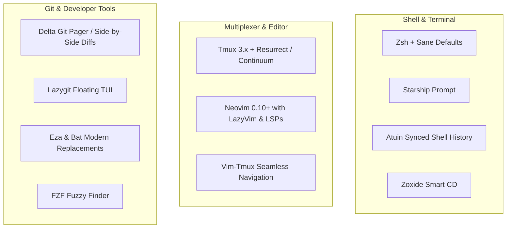

# Dotfiles & Development Environment

An idempotent development environment bootstrapper and configuration suite for **Ubuntu / Debian & WSL2**.

Sets up a high-performance terminal workspace featuring **Neovim (LazyVim)**, **Tmux session persistence**, **Starship prompt**, **Atuin shell history sync**, **Delta git pager**, and modern CLI tools in a single command.

---

## Workspace Architecture



---

## ⚡ Quickstart: One-Command Bootstrap

Clone the repository into `~/dotfiles` and execute the bootstrap script:

```bash
git clone https://github.com/Jpatching/dotfiles.git ~/dotfiles
cd ~/dotfiles
chmod +x bootstrap.sh
./bootstrap.sh
```

### What `bootstrap.sh` does:
1. **Base Packages**: Installs `zsh`, `tmux`, `ripgrep`, `fd-find`, `fzf`, `bat`, `zoxide`, `direnv`, `eza`, `xclip`, `build-essential`.
2. **Neovim**: Downloads and extracts the latest official release into `/opt/nvim` and links to `/usr/local/bin/nvim`.
3. **Node & LSPs**: Installs `nvm` and latest LTS Node (required by Mason LSP managers).
4. **Starship Prompt**: Installs the cross-shell prompt and links `starship.toml`.
5. **Lazygit & Delta**: Installs latest GitHub binary releases for terminal Git ergonomics.
6. **Atuin**: Installs SQLite-backed, encrypted shell history.
7. **Neovim Config**: Automatically clones [Jpatching/nvim-config](https://github.com/Jpatching/nvim-config) into `~/.config/nvim`.
8. **Tmux & TPM**: Installs Tmux Plugin Manager (`tpm`), configures seamless Vim-Tmux split navigation (`Ctrl-h/j/k/l`), and auto-installs persistence plugins (`tmux-resurrect`, `tmux-continuum`).
9. **Symlinks**: Links all dotfiles (`.zshrc`, `.tmux.conf`, `starship.toml`) idempotently.
10. **Default Shell**: Sets `zsh` as default user shell.

---

## Keybindings & Daily Workflow

| Keybinding | Tool / Action | Description |
| :--- | :--- | :--- |
| `Ctrl-h / j / k / l` | Vim + Tmux | Seamless pane navigation across Neovim splits and Tmux panes |
| `tm` | Shell Alias | Attach or create primary `main` tmux session |
| `lg` or `<leader>gg` | Lazygit | Open floating interactive Git TUI |
| `z <dir>` | Zoxide | Smart jump to frecent directory |
| `Ctrl-r` | Atuin / FZF | Interactive, searchable shell command history |
| `Prefix + \|` | Tmux | Split pane horizontally in current working directory |
| `Prefix + -` | Tmux | Split pane vertically in current working directory |
| `Prefix + Ctrl-s / Ctrl-r` | Tmux Resurrect | Save / restore entire Tmux session state |

---

## Repository Structure

```
dotfiles/
├── bootstrap.sh            # Main idempotent installer
├── shell/
│   ├── .zshrc              # Zsh configuration, aliases, and tool hooks
│   └── starship.toml       # Fast, minimal prompt theme
├── tmux/
│   └── tmux.conf           # Tmux configuration with TPM and Vim navigation
└── README.md
```

---

## License
MIT
